## 智慧电子签系统客户端

_在这里只展示了部分功能的截图，未展示的功能与已展示的功能截图类似_

### 个人中心

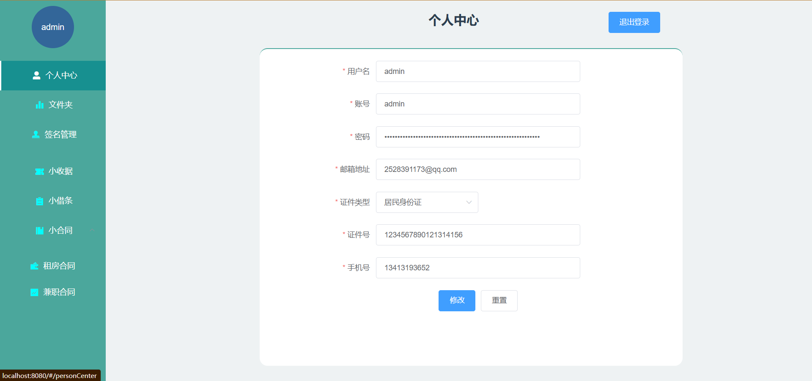

### 文件夹

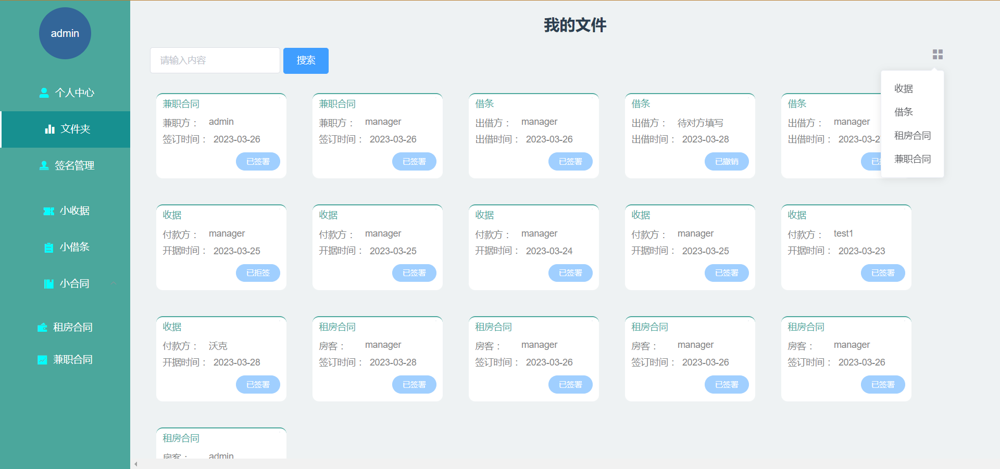
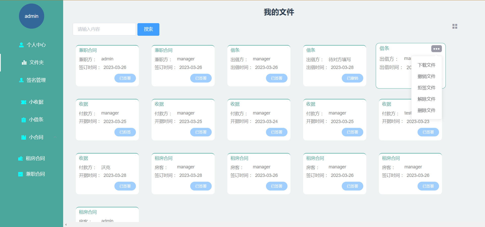

### 签名管理

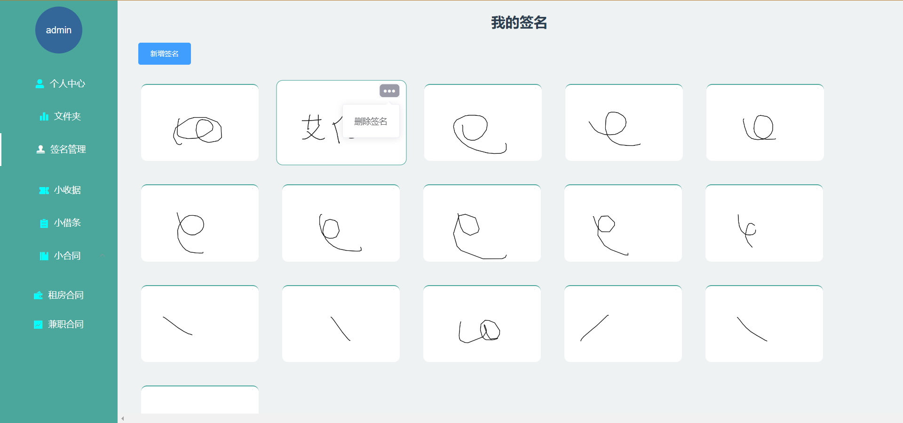

### 预览模板

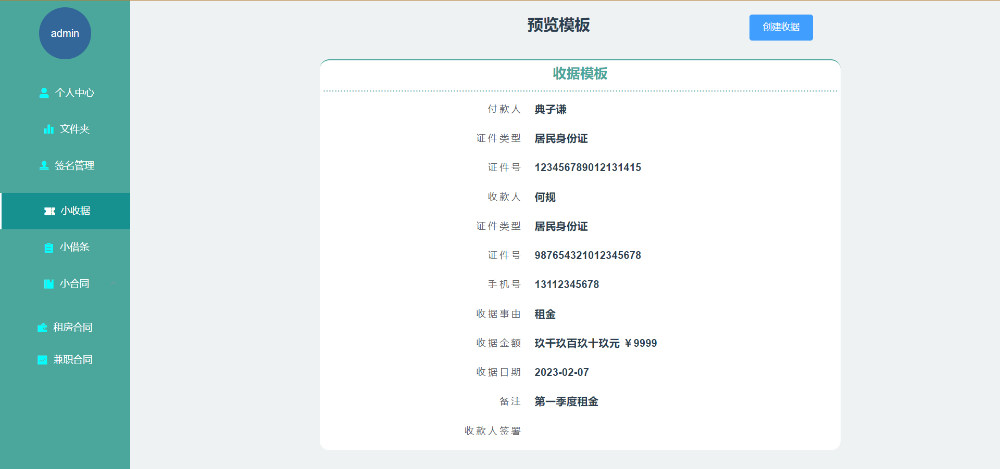

### 创建合同

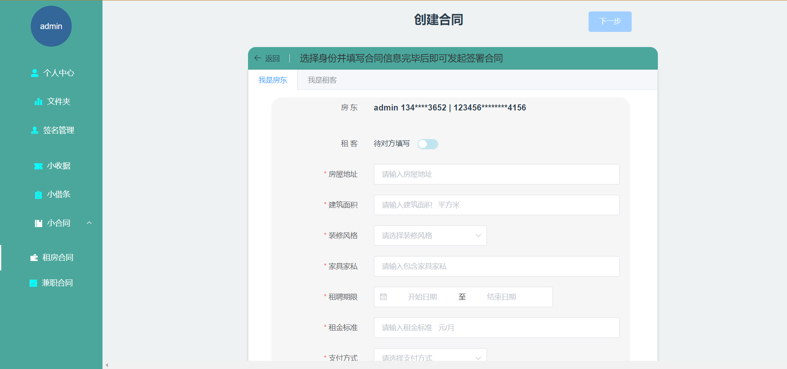

### 预览合同

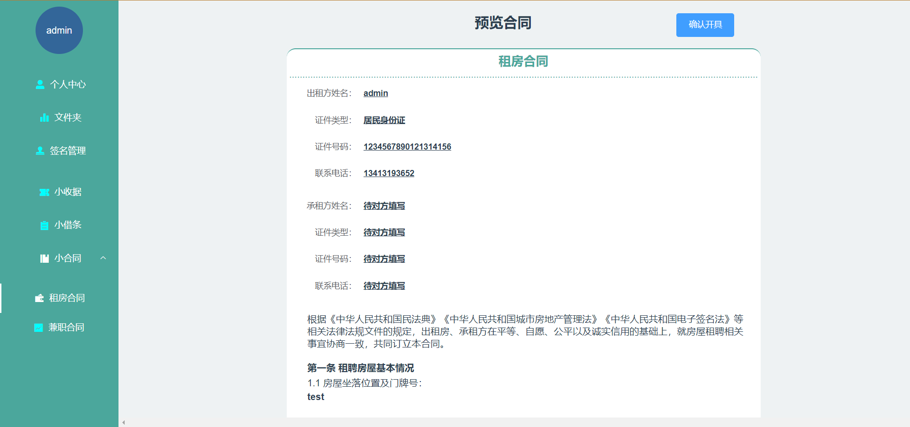

### 签署文件

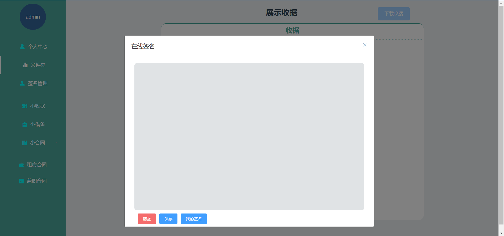

### 下载文件

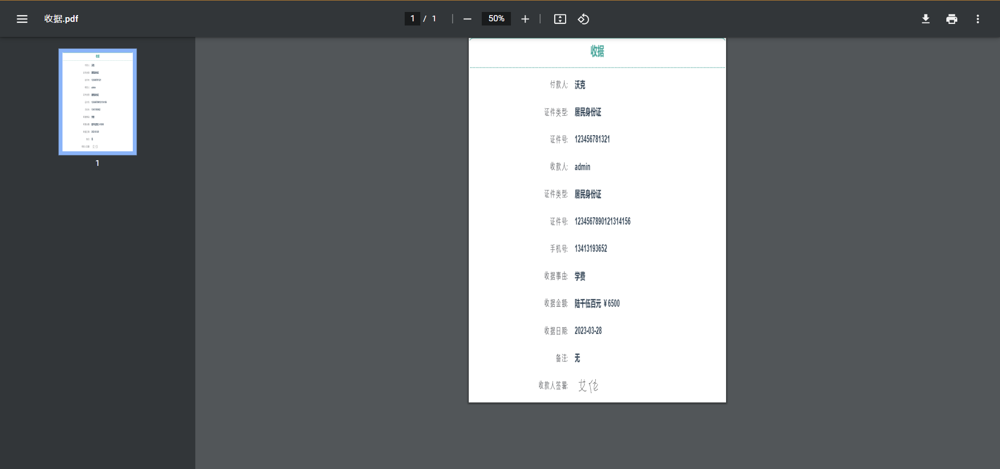

## 后台管理

### 数据分析

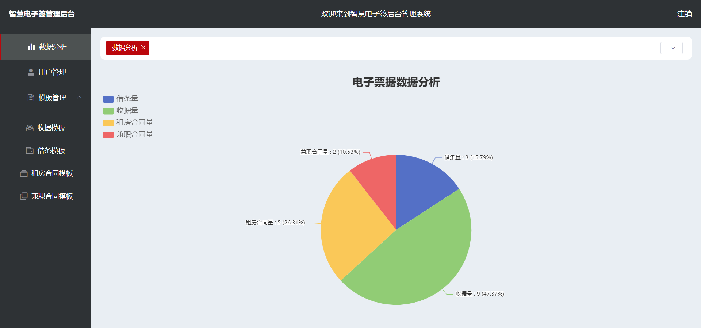

### 用户管理

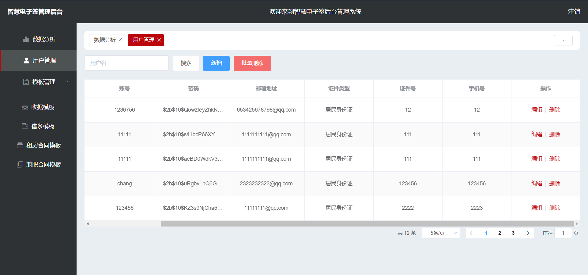

### 修改用户

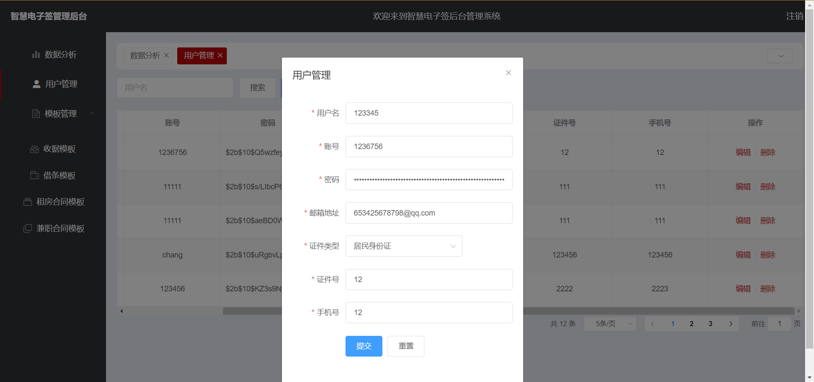

### 收据模板

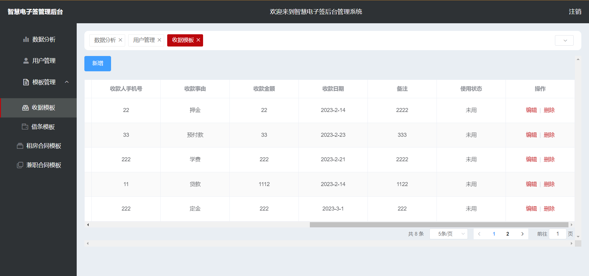

### 修改收据

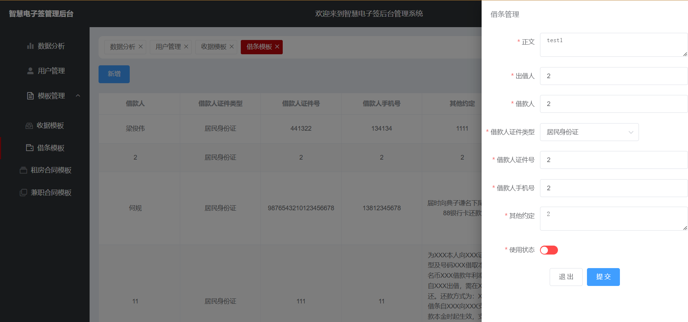

### 借条模板

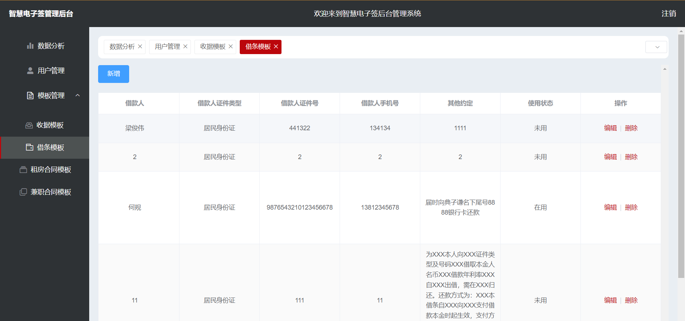

### 修改借条

### 租房合同模板

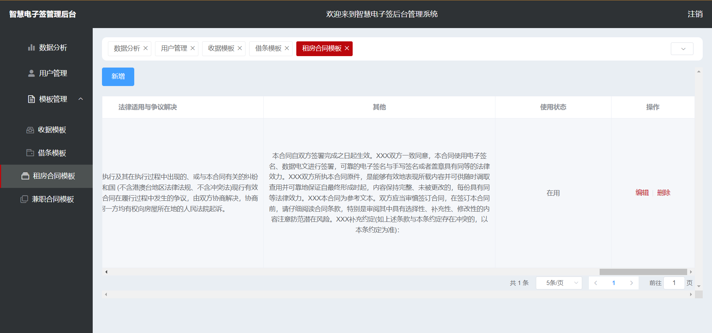

### 兼职合同模板

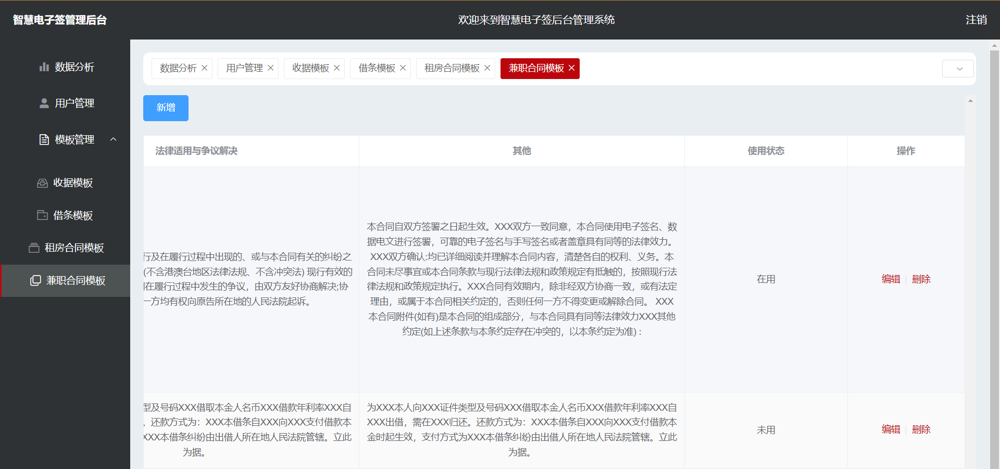
